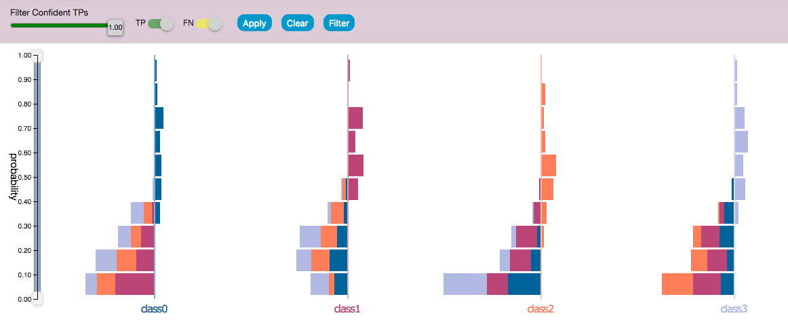

# Performance Analysis of Probabilistic Classifiers

Performance analysis is a critical step in the training of machine learning models. Efficient performance analysis helps interpret classifiers, uncover reasons behind incorrect classifications, and assess of the reliability of predictions. Aggregrate metrics such as accuracy and precision obscure information about prediction probabilities and input values.

This web application addresses common classification practices and performance analysis of probabilistic classifiers.  Analytical tasks that the application supported include:
1. Examine and visualize overall performance of classifier
2. Visualize class-level performance of classifier through visualizing the distribution of false positives (FP), true positives (TP), false negatives (FN), and true negatives TN in each class.
3. Examine instance-level performance
4. Identify between-class confusion
5. Identify examples of interest such as FN with high confidence scores since these examples can be more easily shifted to the correct class. 
6. Identify more severe errors such as FP with high confidence scores or FN with low confidence scores. 
7. Compare feature values for subsets of the dataset

## Components

### Probability Histograms for TPs and FNs
- Samples are divided based on their true classes and the prediction score distribution is visualized for each class.
- Bars on the right are prediction scores of correctly predicted samples. Bars on the left are prediction scores of incorrectly predicted samples. 
- Each bar is colored with the color of the predicted class. 
<br/>



### Probability Histograms
- Histogram of the prediction score for each class for every sample in the dataset. 
- The dataset is divided into classification results, TP, FP, TN, and FN which are distinguished by the pattern of the bar. The bar color of the bar corresponses with the predicted class. 
- The right histogram contains samples predicted of that class. Solid bars are correct predictions and striped are incorrect. - The left side contains samples that were not predicted of belong in this class – FNs are instead outlined with the color of the falsely predicted class. 
- There is a one to one correspondence between FPs and FNs which allows FPs and FNs errors to have represented with equal priorities. 
- Common class-level precision can be estimated by the solid bars out of the solid + striped bars, and recall can be estimated by solid bars out of solid + outlined bars.
<br/>


### Distance Histograms 
- We can use features to interpret why certain samples have similiar or different predictions.
- A trivial method of measuring the similarity of samples is to compute the distances of the samples from the origin. 
- The system computes four spatial distances - Minkowski, Cosine, Euclidean, and Manhattan - from the feature values for each sample and plots the distance distribution for the predicted samples. 
<br/>


### Datatable 
- Each row details the true and predicted classes, prediction scores, and feature values for each sample. 
- Each rowp's color corresponds to the predicted class. 
- The columns can be sorted to identify samples of interest.
<br/>


- When a row is clicked, a line intersects the probability distribution histograms axes at the prediction score for that class. 
- Use case : Confident predictions can be visualized with a like with a high peak at a single class. Confusing samples have a more plateau line since the differences in the predicted scores are smaller. Moreover, samples that are confused between two classes will show two high peaks in the line.
<br/>


### Boxplots
- Displays feature distribution for the selected subsets of samples via boxplots. 
- Use selects bars on the histograms to visualize feature distributions. 
- The features are sorted based on separation power of the selected subsets. Can be used to identify features with high separation power for two different sets of samples. 

<br/>


## Dependencies
Flask

## Running the web app
Clone the repository 
```
$ git clone https://github.com/helenzhao093/performance-analysis-of-probabilistic-classifiers.git
```
Run the flask app locally from port 5000 
```
python app.py
```
Go to http://127.0.0.1:5000/index to use the application with a pre-loaded dataset


